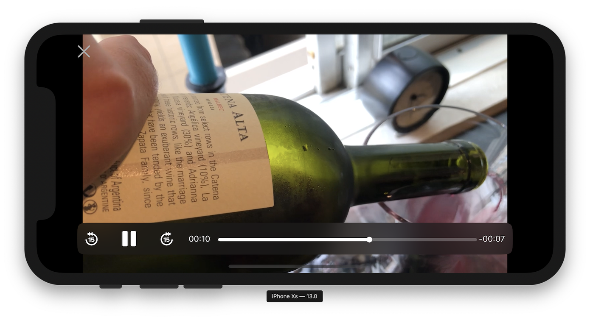
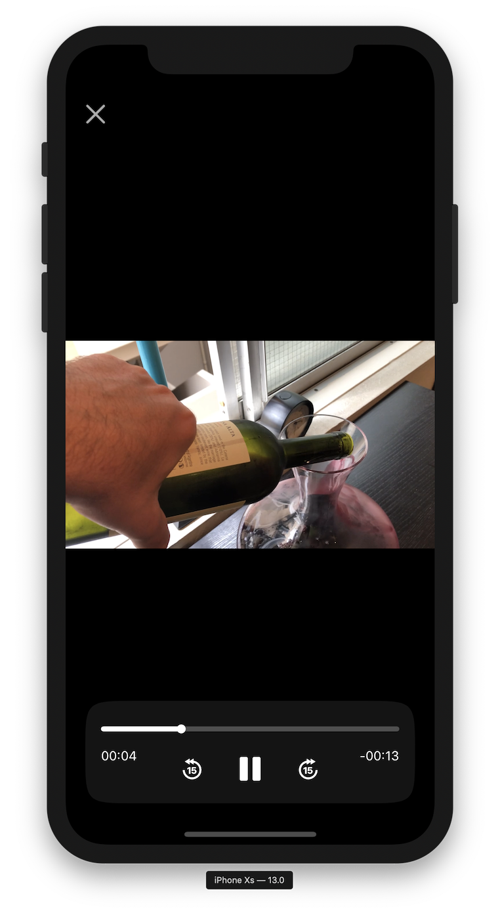

# iOS Video Player

Custom video player that supports interactive transitioning and playback controls with adaptive layout.

### Motivation

The stock `AVPlayerViewController` only supports `UIModalTransitionStyle.coverVertical`; anything else will
break the layout of the video layer during the transition. This project demonstrates a **custom player view controller** built from scratch
using the lower-level `AVPlayerLayer` API, and custom interactive transitions based on `UIViewControllerAnimatedTransitioning` and `UIViewControllerTransitioningDelegate`.

### Screenshots

